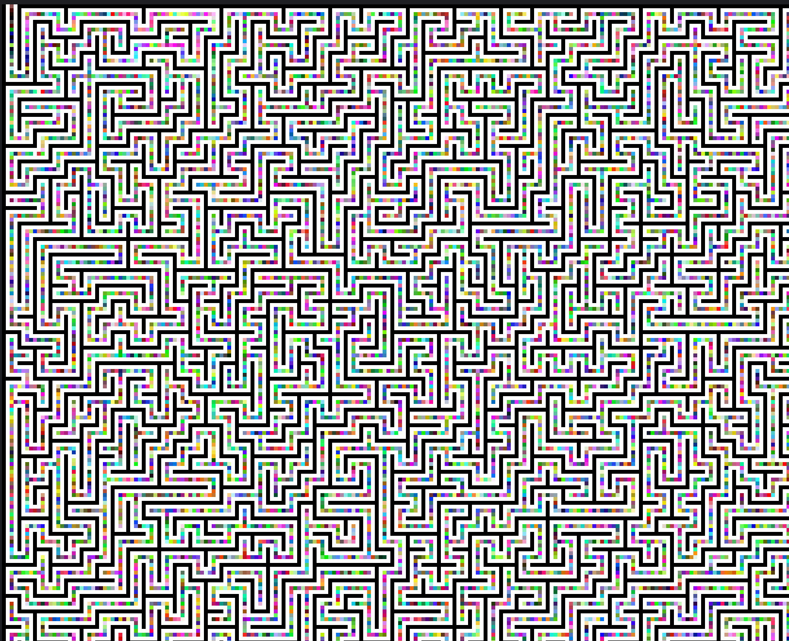

# Inception

* baby's 1<sup>st</sup>
* OMGACM
* local

## Description

> Do you know what the difference between a labyrinth and a maze is?
>
> Labyrinths don't stall the pipeline.

---

## Challenge

Provided with the challenge is a giant image of a maze:

<details>
  <summary>Full maze image</summary>


</details>

If we look closely, we can see that the path of the maze is actually made up of a bunch of colored squares.



In the top left and bottom right corners, we can find the entry and exit points of the maze.


If we check the RGB values of the first pixel in the top left corner we get the following values: ``89504E`` which is
the hex representation of the string ``\x89PN``. This is the magic number for PNG files, so we can assume that the top
left corner is the entry point of the maze and the path of the maze is actually another image.

Now we need to find a way to find the right path through the maze, so we can collect the pixels on the way and extract
the next image. For this we can use the [A* search algorithm](https://en.wikipedia.org/wiki/A*_search_algorithm).

## Solution

The solution is a Python script that uses the A* search algorithm to find the shortest path through the maze. At the
sides of the path are white and black pixels, so we can use those to determine the path. We do this by setting very high
costs for walking over white and black tiles and a low cost for other colors. The script will then output the path as a
list of coordinates, which we can use to extract the pixels from the maze image.

> Note: During the first try we realized that black and white pixels are not always on the sides of the path, but
> somtimes the path contains black and white pixels as well. That's why giving a high coast to walk over black and white
> pixels was a good idea instead of just completely prohibiting it.

```python
# Define the heuristic function for A* search
def heuristic(a, b):
    return abs(a[0] - b[0]) + abs(a[1] - b[1])


def a_star_search(image, start, goal):
    """
    Perform A* search to find the path from start to goal in the maze, while staying on the colorful path.
    """
    # Priority queue to store the nodes to explore, sorted by priority
    frontier = PriorityQueue()
    frontier.put((0, start))

    # Dictionaries to store the cost to reach each node and the path to each node
    cost_so_far = {start: 0}
    came_from = {start: None}

    # Directions to move in the maze
    directions = [(0, 1), (0, -1), (1, 0), (-1, 0)]

    # Loop until there are no more nodes to explore or the goal is found
    while not frontier.empty():
        _, current = frontier.get()

        # Check if the goal has been reached
        if current == goal:
            break

        # Explore neighboring nodes
        for direction in directions:
            next_node = (current[0] + direction[0], current[1] + direction[1])

            # Check if the next node is within the image boundaries
            if 0 <= next_node[0] < image.shape[0] and 0 <= next_node[1] < image.shape[1]:
                # Get the color of the next node
                color = image[next_node]

                # Assign a high cost to white and black pixels, and a low cost to colorful pixels
                if (color == [255, 255, 255]).all() or (color == [0, 0, 0]).all():
                    cost = 100_000_000  # High cost for white and black
                else:
                    cost = 1  # Low cost for colorful pixels

                new_cost = cost_so_far[current] + cost

                # If the next node hasn't been visited or a cheaper path has been found, update the data structures
                if next_node not in cost_so_far or new_cost < cost_so_far[next_node]:
                    cost_so_far[next_node] = new_cost
                    priority = new_cost + heuristic(goal, next_node)
                    frontier.put((priority, next_node))
                    came_from[next_node] = current

    # Reconstruct the path from the start to the goal
    current = goal
    path = []
    while current != start:
        path.append(current)
        current = came_from[current]
    path.append(start)
    path.reverse()

    return path
```

We also implemented a function to highlights the path in the maze image and change the patch color every time the path
goes over a black or white pixel.

```python
def highlight_path(image, path, output_image_path):
    # Highlight the path
    path_color = [0, 0, 255]  # BGR format
    for point in path:
        color = image[tuple(point)]
        if (color == [0, 0, 0]).all() or (color == [255, 255, 255]).all():
            # If the path is crossing a black or white tile, shift the color
            path_color = path_color[1:] + path_color[: 1]
            print("The path is crossing a black or white tile!")
        image[tuple(point)] = path_color

    # Save the new image
    cv2.imwrite(output_image_path, image)

    print(f"The path has been highlighted and saved to {output_image_path}")
```

Now we can run the script to find the path through the maze and highlight it in the image:


The script then extracts the pixels on the path and saves them to a new image, then it repeats the process until it gets
data that is not a PNG file anymore. The last file then contains the flag.

#### [Solver Script](inception.py)

## Useful links

* https://willgreen.tech/writeups/Tenable-CTF-2021-Writeups/#challenge-look-at-all-the-pixels-where-do-they-all-come-from